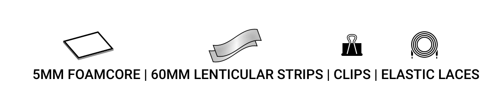

<h1 align="center">Lovely Bezel Free Kit</h1>

A simple, do-it-yourself Bezel Free Kit Mount template. <em>Just add lenticular films.</em>

 

### 🔌 If you like this dashboard & overlay, please consider subscribing to my Youtube channel [Lovely Sim Racing](http://j76.me/LSR), where I stream as often as I can. You'll even see them both in action.

### Please consider [buying me a coffee](http://j76.me/BuyMeCoffee) :coffee: or snagging some [Lovely Merch](http://j76.me/LSRStore) 

#### Check out my other projects:
* [**Lovely Simhub Dashboard**](http://j76.me/LSRDash)
* [**Lovely Stream Deck Icons**](http://j76.me/LSRIcons)
* [**Lovely Sim Racing Liveries**](http://j76.me/LSRLivery)

---

 

<strong><em>JOIN the Lovely Discord Server</em></strong> 
Join the Discord Server for more Lovely Projects. 
👉 <a href="http://j76.me/LSRDiscord">Discord Server</a>

 
<h4 align="center">
<a href="https://youtu.be/8hztdW_aDdY">
 
The Lovely Bezel Free kit in Action
</a>
</h4> 

## DIY Bezel Free Kit 
I found myself with a broken TV and after learning about the Lenticular film inside of it, I decided that I needed to make myself a Bezel Free Kit for my triples. Unfortunatley, I do not have a 3D printer nor would I bother accessing one (yet). I tried to find alternative options to the ASUS RIOG Bezel Free Kit mounts, but still was not really happy with the avaialble options. So, I did what I like to do the most... I got creative.

I had some foamcore board laying around (yeah, I make things), and if you've ever used it before, you'll know how easy it is to cut but also how rigid it is. So, this was my first go-to material. And it worked. I later tweaked the design and added two layers for extra rigidity. 

I made some changes to how I mounted the actual Lenticular film and eventually I resolved to the template below. Obviously these mounts fit ***any*** screen size, as long as you have a large enough lenticular film.

## Ingredients
This is a DIY project, and as such you will need to source the materials yourself to get this done.

The star of the project is the Lenticular film which can be found in any old LED TV. Instructions on how to extract it [can be found on Youtube](https://www.youtube.com/results?search_query=diy+bezel+free+kit). When youn have it, you need to cut it length-wise into 60mm strips. You will need only two, so consider giving the rest to a friend if needed. 

Fortunately, all of the other items required are easily found in any arts & crafts store. For this project, you will need:

* 2x A4 sized 5mm Foamcore board ([Get it on Amazon](https://www.amazon.de/-/en/Cathedral-A4-Foam-Board-Black/dp/B00BZ1VREG/ref=sr_1_1?crid=2V4NTFSX9BVYM&amp;keywords=schaumkern%252B5%252Bmm%252Ba4&amp;qid=1682930947&amp;sprefix=foamcore%252B5mm%252Ba%252Caps%252C115&amp;sr=8-1&amp;th=1&_encoding=UTF8&tag=lovelysimraci-21&linkCode=ur2&linkId=fb7b8388eb7d9eb4b6b7d215c46c81fd&camp=1638&creative=6742))
* 2x 51mm Foldback Clips (or the largest you can find) ([Get it on Amazon](https://www.amazon.de/-/en/D-RECT-Foldback-Multi-Purpose-Writing-Supplies/dp/B07VQJ33ML/ref=sr_1_7?crid=2A8FMAP01V8AC&amp;keywords=foldback%252Bclips%252B51%252Bmm&amp;qid=1682930315&amp;sprefix=foldback%252Bclips%252B51mm%252Caps%252C107&amp;sr=8-7&amp;th=1&_encoding=UTF8&tag=lovelysimraci-21&linkCode=ur2&linkId=fcd9ba18fde7b983a2eb46522879b562&camp=1638&creative=6742))
* 2x 100cm Elastic Shoe Lace ([Get it on Amazon](https://www.amazon.de/dp/B09KPJH188?ref_=cm_sw_r_cp_ud_dp_1ZCY86WZX8D1SN19WG68&_encoding=UTF8&tag=lovelysimraci-21&linkCode=ur2&linkId=577eb346b6609ddcc447dc004cbc6350&camp=1638&creative=6742))
* Super Glue to hold everything together ([Get it on Amazon](https://www.amazon.de/Super-Liquid-Minis-Original-Sealed/dp/B06WWB38CW/ref=sr_1_3_sspa?crid=19TFJLCQ0KX81&amp;keywords=superkleber&amp;qid=1682931052&amp;sprefix=super%252Bglue%252Caps%252C158&amp;sr=8-3-spons&amp;sp_csd=d2lkZ2V0TmFtZT1zcF9hdGY&amp;th=1&_encoding=UTF8&tag=lovelysimraci-21&linkCode=ur2&linkId=80a2ad0b6f7d158441d53f00dabc0604&camp=1638&creative=6742))

## The Template
Download the PDF file and print it at 100% size. It is made to fit an **A4 size** page, so make sure you select the right paper size. Each page is good for a single side mount, so unless you've got a really weird setup, you will need to print out two sheets.

## Assembly
Once you've got all the pieces cut and ready, all you need to do is follow the below assmbly instructions. Use one A4 template per side.

## Tip for Perfect Fitting
:bulb: If your monitor has a lip, you can cut out a bit on either side of the fims. The idea is to get the film to sit flat on the screen. 

**Once fitted, adjust the top and bottom mounts by moving them left or right, until you find the sweet spot.**

  

---

 

####Disclaimer
The above document contains affiliate links, which I get a commision from every sale. Consider supporting this work by using those links.

 

This work is licensed under [Creative Commons Attribution-NonCommercial-ShareAlike 4.0 International](http://creativecommons.org/licenses/by-nc-sa/4.0/)
